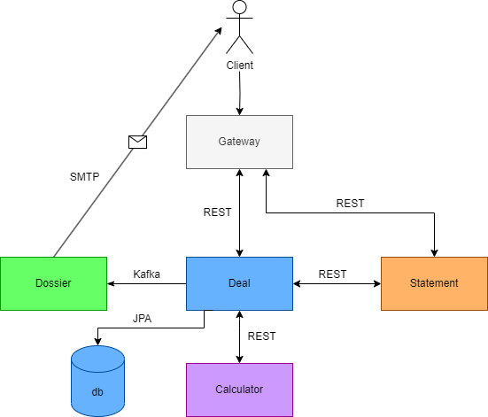
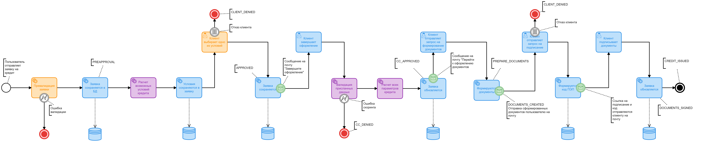

# neoflex-study
This is an educational development of the 'Credit Bank' backend application in order to gain an understanding of Spring, PostgreSQL, Kafka and microservice architecture. 
'Credit Bank' is a prototype of small bank system.
## Workflow logic
System Workflow Logic

1. The user submits a credit application.
2. The Application Microservice (MS Application) performs a pre-scoring of the application. If the pre-scoring is successful, the application is saved in the Deal Microservice (MS Deal) and sent to the Calculator Microservice (MS Calculator).
3. The Calculator Microservice returns four loan offers (entity "LoanOffer") with different conditions (e.g., without insurance, with insurance, for salary clients, with insurance and salary clients) or a rejection to the user via the Application Microservice.
4. The user selects one of the offers, which sends a request to the Application Microservice and from there to the Deal Microservice, where the credit application and the loan itself are saved in the database.
5. The Dossier Microservice (MS Dossier) sends an email to the client with the text "Your application is preliminarily approved, please complete the process."
6. The client sends a request to the Deal Microservice with all their full details about the employer and registration.
   The data scoring occurs in the Calculator Microservice, which calculates all the credit details (APR, payment schedule, etc.). The Deal Microservice saves the updated application and the loan entity created based on the CreditDto received from the Calculator Microservice with the status CALCULATED in the database.
7. After validation, the Dossier Microservice sends an email to the client with approval or rejection.
   If the credit is approved, the email contains a link to the request "Generate Documents."
8. The client sends a request to generate documents to the Dossier Microservice, which sends the documents to the client's email for signing and a link to the request for consent to the terms.
9. The client can either reject or agree to the terms.
   If agreed, the Dossier Microservice sends a code and a link to sign the documents to the client's email, where the client must send the received code to the Deal Microservice.
10. If the received code matches the sent code, the Deal Microservice issues the credit (changes the status of the "Credit" entity to ISSUED, and the status of the application to CREDIT_ISSUED).
## Microservices
The application consists of several MS applications:
- [x] Calculator
- [x] Deal
- [x] Statement 
- [x] Dossier 
- [ ] Gateway
## Architecture and business-flow

